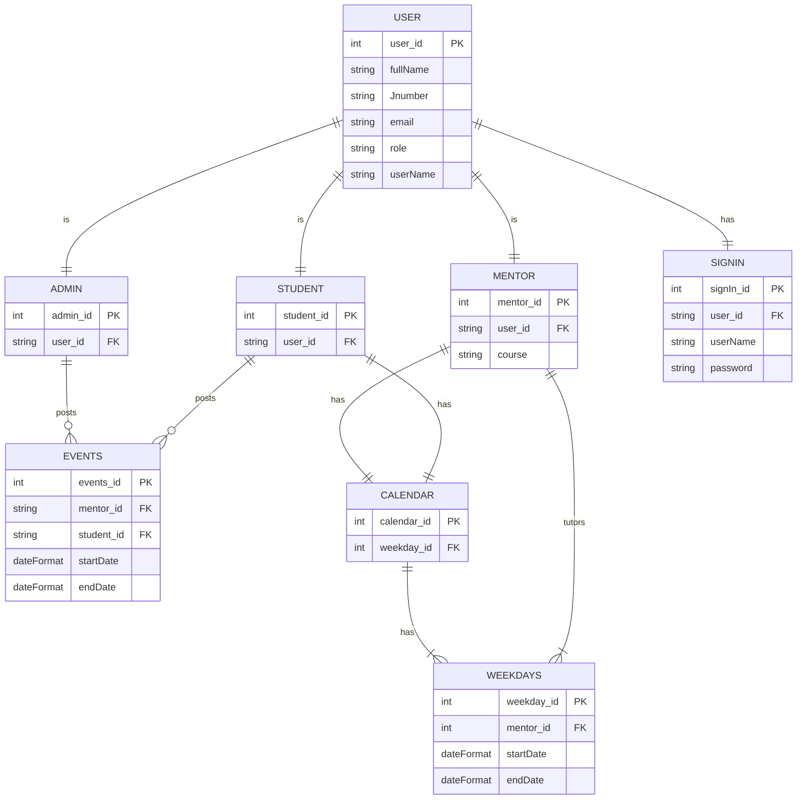

# This diagram represents the ER relationship diagram among the entities below

#

# In order to understand the cardinality, please refer to the mermaid documentation

# https://mermaid-js.github.io/mermaid/#/entityRelationshipDiagram

#

#

#

#

